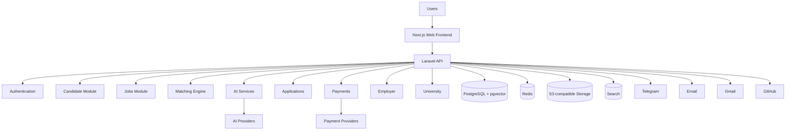

# JobPilot

An AI-powered career and job platform built for Ethiopia: job discovery, intelligent matching, CV tailoring, cover letters, application tracking, employer recruitment, and university career services.

> **Status:** Foundation stage. The repository currently contains the specification, architecture docs, local infrastructure, and the backend domain skeleton. Application code starts in Phase 1 (see [docs/IMPLEMENTATION_PLAN.md](docs/IMPLEMENTATION_PLAN.md)).

## What it does

- **Job seekers:** profile and CV, job search, AI match scores with explanations, skill gaps, CV tailoring, cover letters, application tracking, career assistant.
- **Employers:** company verification, job posting, applicants, recruitment pipeline.
- **Universities:** institutions, cohorts, career resources, aggregated analytics (privacy-preserving).
- **Admins:** moderation, verification, AI and payment monitoring, audit logs.
- Localized for Ethiopia: English and Amharic first, low-bandwidth friendly, Telegram/email notifications, local payment providers behind an abstraction.

## Architecture



Modular monolith (Laravel) + Next.js frontend. See [docs/ARCHITECTURE.md](docs/ARCHITECTURE.md).

## Repository layout

```text
backend/    Laravel API, organized by domain (app/Domain/*)
frontend/   Next.js + TypeScript + Tailwind web app
docs/       Specification, architecture, plan, and design docs
infra/      Deployment and infrastructure config
```

## Local setup

Prerequisites: Docker, and (once scaffolded) PHP 8.3+, Composer, Node 20+.

```bash
cp .env.example .env
docker compose up -d      # Postgres(+pgvector), Redis, MinIO, Mailpit
```

| Service | URL |
|---|---|
| Postgres | localhost:5432 |
| Redis | localhost:6379 |
| MinIO console | http://localhost:9001 |
| Mailpit inbox | http://localhost:8025 |

Backend and frontend run instructions are added in Phase 1.

## Documentation

- [Specification](docs/SPEC.md)
- [Implementation plan](docs/IMPLEMENTATION_PLAN.md)
- [Architecture](docs/ARCHITECTURE.md)
- [Database](docs/DATABASE.md)
- [AI](docs/AI.md)
- [Payments](docs/PAYMENTS.md)
- [Security](docs/SECURITY.md)
- [Deployment](docs/DEPLOYMENT.md)
- [API](docs/API.md)
- [Contributing](docs/CONTRIBUTING.md)
