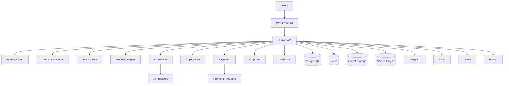

# MASTER BUILD PROMPT
## AI-POWERED ETHIOPIAN CAREER & JOB PLATFORM

You are the lead software architect, senior full-stack engineer, AI engineer, DevOps engineer, security engineer, UI/UX engineer, database architect, and QA engineer responsible for designing and implementing a **production-grade AI-powered Ethiopian career and job platform**.

This is not a simple job board.

The product is an **Aarivi-inspired but independently designed Ethiopian career intelligence platform** that combines:

- Job discovery
- Intelligent job matching
- CV/resume intelligence
- AI career assistance
- CV tailoring
- Cover-letter generation
- Application tracking
- Career recommendations
- Employer recruitment
- University career services
- Portfolio generation
- GitHub integration
- Job alerts
- Telegram/email notifications
- Ethiopian payment/subscription infrastructure
- Analytics
- Scam/fraud detection
- AI-powered candidate/job intelligence

The primary product is a **responsive web platform**.

A mobile application is NOT the primary MVP. Design the architecture so that a mobile app or PWA can be added later without rewriting the backend.

---

# 1. PRODUCT VISION

Build the leading intelligent career platform for Ethiopia.

The platform should help a person move through the entire employment journey:

```text
Create Account
      ↓
Build Professional Profile
      ↓
Upload / Create CV
      ↓
AI Understands Candidate
      ↓
Discover Relevant Jobs
      ↓
AI Matches Candidate to Jobs
      ↓
Explain Why the Job Fits
      ↓
Identify Missing Skills
      ↓
Tailor CV
      ↓
Generate Cover Letter
      ↓
Apply
      ↓
Track Application
      ↓
Prepare for Interview
      ↓
Receive Career Guidance
      ↓
Get Hired
```

At the same time, employers should be able to:

```text
Create Company
      ↓
Verify Company
      ↓
Post Job
      ↓
Receive Applications
      ↓
Search / Filter Candidates
      ↓
AI-assisted Candidate Ranking
      ↓
Shortlist
      ↓
Interview
      ↓
Hire
```

Universities should be able to:

```text
Manage Institution
      ↓
Manage Students / Graduates
      ↓
Provide Career Resources
      ↓
Publish Opportunities
      ↓
Connect Students with Employers
      ↓
Track Employability Outcomes
```

---

# 2. CRITICAL ENGINEERING PRINCIPLE

Do NOT build this as a collection of disconnected AI features.

Build a proper software system where:

### Layer 1 — Platform Data

The database is the source of truth.

Examples:

- users
- candidates
- companies
- jobs
- skills
- education
- experience
- applications
- subscriptions
- payments
- portfolios
- institutions

### Layer 2 — Deterministic Intelligence

Use normal backend logic for things that must be exact.

Examples:

- years of experience
- skill overlap
- required qualification
- job seniority
- location
- salary
- application status
- subscription status
- payment verification
- eligibility
- account permissions

### Layer 3 — Semantic Intelligence

Use embeddings/vector search for:

- similar skills
- similar job descriptions
- related roles
- semantic CV/job similarity
- career recommendations

### Layer 4 — Generative AI

Use LLMs for:

- CV parsing
- CV improvement
- CV tailoring
- cover letters
- job explanations
- career advice
- interview preparation
- skill-gap explanations
- conversational career assistant

The AI must NOT become the source of truth for factual platform data.

---

# 3. WEBSITE-FIRST REQUIREMENT

The primary product is a **high-end responsive website**.

It must work extremely well on:

- desktop
- laptop
- tablet
- mobile browser

Do NOT design the system around a mobile application.

The architecture must nevertheless expose a clean API so that a future:

- Android application
- iOS application
- Flutter application
- React Native application
- PWA

can consume the same backend.

---

# 4. TARGET USERS

Implement these roles:

## 4.1 Job Seeker

Can:

- register/login
- create profile
- upload CV
- create CV
- edit profile
- manage education
- manage experience
- manage skills
- manage projects
- manage certifications
- manage languages
- set job preferences
- search jobs
- filter jobs
- save jobs
- receive recommendations
- receive AI match scores
- analyze jobs
- identify skill gaps
- tailor CV
- generate cover letters
- apply to jobs
- track applications
- receive reminders
- receive notifications
- use career assistant
- prepare for interviews
- create portfolio
- connect GitHub
- view portfolio analytics
- manage subscription
- manage AI credits

---

# 5. EMPLOYER PLATFORM

Employers must have a separate professional dashboard.

Implement:

## Company

- company registration
- company profile
- company logo
- description
- industry
- location
- website
- social links
- company size
- verification status

## Job Posting

Employers can create:

- job title
- description
- responsibilities
- requirements
- qualifications
- skills
- experience
- salary
- location
- employment type
- work mode
- deadline
- industry
- seniority
- benefits

## Recruitment

Implement:

- applicant list
- candidate profiles
- CV viewing
- filters
- candidate search
- shortlist
- reject
- notes
- candidate tags
- recruitment stages
- interviews
- interview scheduling
- hiring status

Example pipeline:

```text
Applied
   ↓
Review
   ↓
Shortlisted
   ↓
Assessment
   ↓
Interview
   ↓
Final Interview
   ↓
Offer
   ↓
Hired
```

Allow employers to customize stages.

---

# 6. UNIVERSITY / CAREER CENTER PLATFORM

Implement a university/institution role.

University administrators should be able to:

- create institution profile
- create faculties/departments
- manage cohorts
- manage students/graduates
- publish career resources
- publish opportunities
- organize career events
- connect employers
- track graduate employment outcomes
- view aggregated employability analytics

Protect student privacy.

Universities must not automatically gain access to private candidate data.

---

# 7. ADMIN PLATFORM

Build a powerful administrative dashboard.

Admin capabilities:

### User Management

- users
- candidates
- employers
- universities
- administrators
- suspensions
- bans
- verification

### Job Management

- jobs
- sources
- duplicate jobs
- expired jobs
- reported jobs
- suspicious jobs
- moderation

### Employer Management

- verification
- approval
- rejection
- company risk score
- reports

### AI Management

- AI provider configuration
- model configuration
- prompts
- token usage
- AI costs
- AI credits
- failure monitoring
- model evaluation

### Taxonomy Management

- skills
- industries
- job categories
- job roles
- seniority levels
- education levels
- institutions

### Financial Management

- plans
- subscriptions
- transactions
- refunds
- payment failures
- invoices
- revenue analytics

### Security

- audit logs
- login activity
- suspicious activity
- API usage
- rate-limit violations

---

# 8. ETHIOPIAN LOCALIZATION

This is extremely important.

Do NOT simply build a foreign job platform and replace the logo.

The platform must be designed around the Ethiopian employment ecosystem.

Support:

- Ethiopian employers
- Ethiopian universities
- Ethiopian NGOs
- international organizations operating in Ethiopia
- government/quasi-government opportunities where legally appropriate
- local private companies
- startups
- remote jobs
- freelance opportunities where appropriate

Support Ethiopian terminology and workflows.

Initial languages:

- English
- Amharic

Architecture must allow:

- Afaan Oromoo
- Tigrinya
- other languages

to be added later.

Use proper i18n rather than hardcoding strings.

---

# 9. LOW-BANDWIDTH DESIGN

The website must perform well under poor connectivity.

Optimize for:

- slow mobile networks
- expensive data
- low-end Android devices
- large numbers of users
- unreliable connections

Implement:

- code splitting
- lazy loading
- optimized images
- WebP/AVIF where appropriate
- caching
- compressed API responses
- pagination
- skeleton loading
- minimal unnecessary requests
- efficient database queries
- background processing
- CDN support

Never download huge files unnecessarily.

---

# 10. TECHNOLOGY STACK

Use a professional production architecture.

Recommended:

## Frontend

Prefer:

- Next.js
- React
- TypeScript
- Tailwind CSS

Use a component system such as:

- shadcn/ui

or another mature accessible component library.

## Backend

Use:

- PHP
- Laravel
- REST API

Use Laravel as a **modular monolith**, not an unnecessarily fragmented microservice architecture.

## Database

Use:

- PostgreSQL

## Cache / Queue

Use:

- Redis

## Search

Start with:

- PostgreSQL full-text search

Design the system so it can later use:

- Meilisearch
- OpenSearch
- Elasticsearch

without rewriting the job system.

## Storage

Use S3-compatible object storage for:

- CVs
- documents
- profile images
- company logos
- portfolio assets

## AI

Implement a provider abstraction.

Support providers such as:

- OpenAI
- Google Gemini
- Anthropic

Do not tightly couple the application to one provider.

---

# 11. BACKEND ARCHITECTURE

Use a modular Laravel architecture.

Recommended structure:

```text
app/
├── Domain/
│   ├── Auth/
│   ├── Users/
│   ├── Candidates/
│   ├── Education/
│   ├── Experience/
│   ├── Skills/
│   ├── CV/
│   ├── Companies/
│   ├── Jobs/
│   ├── JobSources/
│   ├── Search/
│   ├── Matching/
│   ├── Applications/
│   ├── AI/
│   ├── Portfolios/
│   ├── GitHub/
│   ├── Notifications/
│   ├── Payments/
│   ├── Employers/
│   ├── Universities/
│   ├── Analytics/
│   └── Administration/
│
├── Http/
│   ├── Controllers/
│   ├── Requests/
│   ├── Resources/
│   └── Middleware/
│
├── Jobs/
├── Events/
├── Listeners/
├── Policies/
├── Notifications/
└── Console/
```

Keep business logic out of controllers.

Controllers should remain thin.

Use:

- Services
- Actions
- Policies
- Form Requests
- Resources
- Events
- Listeners
- Queue Jobs

where appropriate.

---

# 12. DATABASE

Create a normalized PostgreSQL schema.

Core tables should include:

```text
users
candidate_profiles
candidate_educations
candidate_experiences
candidate_skills
candidate_projects
candidate_certifications
candidate_languages
candidate_preferences

skills
skill_aliases
job_categories
job_roles
industries
institutions

companies
company_users
company_verifications

jobs
job_skills
job_sources
job_source_records

applications
application_events
saved_jobs
job_matches

documents
cv_versions

portfolios
portfolio_projects
portfolio_links
portfolio_visits

github_connections

ai_conversations
ai_messages
ai_usage
ai_transactions
ai_credit_ledger

notifications
notification_preferences

connected_accounts

plans
plan_features
subscriptions
subscription_items
payment_intents
payment_transactions
provider_transactions
invoices
refunds
webhook_events
entitlements

university_profiles
university_departments
university_cohorts

candidate_shortlists
candidate_notes
interviews
interview_slots

reports
audit_logs
analytics_events
risk_scores
```

Use:

- foreign keys
- indexes
- unique constraints
- soft deletes where appropriate
- timestamps
- UUIDs where appropriate
- database transactions
- optimistic locking where useful

Do not over-normalize data that needs efficient read performance.

---

# 13. CV INTELLIGENCE

The CV system is one of the core differentiators.

Workflow:

```text
CV Upload
    ↓
File Validation
    ↓
Malware/Virus Scan
    ↓
Text Extraction
    ↓
AI Parsing
    ↓
Structured Candidate Data
    ↓
Validation
    ↓
Profile Mapping
    ↓
CV Version Stored
```

Extract:

- name
- email
- phone
- location
- summary
- education
- work experience
- skills
- projects
- certifications
- languages
- achievements
- links

Never allow the AI to silently invent information.

If information is uncertain:

```text
confidence = low
```

and request user confirmation.

---

# 14. CV TAILORING

Implement:

```text
Candidate CV
      +
Target Job
      ↓
Requirement Analysis
      ↓
Skill Alignment
      ↓
Experience Relevance
      ↓
CV Optimization
      ↓
Tailored CV
```

The AI may:

- reorder information
- improve wording
- improve structure
- emphasize relevant experience
- improve summaries
- suggest missing sections

The AI must NOT fabricate:

- employment
- degrees
- certifications
- skills
- achievements
- years of experience
- employers

Every generated claim should be traceable to candidate-provided information.

---

# 15. AI COVER LETTER

Generate personalized cover letters using:

- candidate profile
- candidate experience
- target job
- company
- job requirements

Avoid generic AI-sounding writing.

Provide editing before submission.

---

# 16. JOB INGESTION SYSTEM

The platform needs a scalable job ingestion architecture.

Possible sources:

1. Employer direct posting
2. Partner APIs
3. RSS feeds
4. Licensed aggregators
5. Approved public job pages
6. Admin imports
7. CSV imports
8. Other legally permitted sources

Do NOT bypass:

- authentication
- robots restrictions
- anti-bot protections
- rate limits
- website terms
- copyright restrictions

Respect source policies.

Architecture:

```text
Source
  ↓
Scheduler
  ↓
Fetcher
  ↓
Raw Job Record
  ↓
Parser
  ↓
Normalizer
  ↓
Duplicate Detection
  ↓
Validation
  ↓
Fraud/Scam Detection
  ↓
Moderation
  ↓
Publish
  ↓
Search Index
  ↓
Matching Engine
```

Track:

- source
- source URL
- first seen
- last checked
- expiration
- source status
- ingestion errors

---

# 17. JOB DEDUPLICATION

The same job may appear on multiple websites.

Implement duplicate detection using combinations of:

- company
- title
- location
- normalized description
- deadline
- source URL
- content fingerprint
- semantic similarity

Keep source references rather than showing duplicate jobs repeatedly.

---

# 18. JOB SEARCH

Implement advanced search:

- keyword
- job title
- company
- location
- remote
- hybrid
- onsite
- salary
- experience
- education
- employment type
- industry
- skills
- deadline
- date posted
- seniority

Include:

- sorting
- pagination
- saved searches
- alerts

---

# 19. AI JOB MATCHING

Create a real matching engine.

Do NOT simply ask an LLM:

> "Does this person match this job?"

Instead calculate a structured score.

Example:

```text
Match Score
=
Skills Score
+ Experience Score
+ Education Score
+ Seniority Score
+ Location Score
+ Work Mode Score
+ Preference Score
+ Semantic Similarity
- Hard Requirement Penalties
```

All weights must be configurable.

Example output:

```text
Overall Match: 87%

Skills:        92%
Experience:    84%
Education:     100%
Location:      100%
Seniority:     80%
Semantic Fit:  88%

Strong Matches:
✓ SQL
✓ Laravel
✓ Reporting
✓ Business Analysis

Missing / Weak:
△ Power BI
△ 2+ years required

Recommendation:
Strong candidate. Apply.
```

The system must explain its score.

---

# 20. CAREER ASSISTANT

Build an AI career assistant.

It should understand:

- candidate profile
- CV
- skills
- experience
- education
- saved jobs
- applications
- goals

It should answer:

- Which jobs should I apply to?
- Why am I not getting interviews?
- What skills should I learn?
- How can I improve my CV?
- What jobs fit my background?
- What should I prepare for this interview?
- What career path could I pursue?
- Which skills are missing?

Use retrieval/tool-based architecture rather than dumping the entire database into every prompt.

---

# 21. AI SECURITY

Protect against:

- prompt injection
- malicious CV content
- malicious job descriptions
- data exfiltration
- indirect prompt injection
- model hallucination
- excessive AI usage
- automated abuse
- prompt leakage

Never allow user-provided content to directly control system instructions.

Separate:

```text
System Instructions
Developer Instructions
Platform Data
User Data
Untrusted External Content
```

Treat job descriptions and CV documents as untrusted input.

---

# 22. APPLICATION TRACKING

Users can manually track applications.

Statuses:

```text
Saved
Applied
Viewed
Screening
Assessment
Interview
Final Interview
Offer
Hired
Rejected
Withdrawn
```

Every status change creates an:

```text
application_event
```

Store:

- timestamp
- old status
- new status
- source
- notes

Display applications as:

- Kanban board
- timeline
- table
- analytics dashboard

---

# 23. GMAIL INTEGRATION

Design Gmail integration using OAuth.

With user authorization, the system may identify relevant application emails and update application timelines.

Never request a user's Gmail password.

Never silently read unrelated email.

Implement:

- OAuth
- scoped permissions
- encrypted tokens
- revocation
- synchronization
- privacy controls

Allow users to disconnect Gmail.

---

# 24. TELEGRAM

Telegram is important for Ethiopian job seekers.

Implement Telegram integration for:

- job alerts
- recommended jobs
- application reminders
- interview reminders
- career notifications

Users should explicitly connect their Telegram account.

Allow notification preferences.

---

# 25. EMAIL

Implement transactional email:

- registration
- verification
- password reset
- job alerts
- application reminders
- interview reminders
- payment receipts
- subscription changes

Use a proper email provider abstraction.

---

# 26. GITHUB INTEGRATION

Allow users to connect GitHub.

Extract:

- repositories
- languages
- project descriptions
- stars
- activity
- contributions where permitted
- README content

Use GitHub information to enhance:

- developer profiles
- portfolios
- job matching
- project recommendations

Do not expose private repositories without explicit permission.

---

# 27. PORTFOLIO SYSTEM

Allow users to create a professional public portfolio.

Example:

```text
platform.com/u/username
```

Portfolio sections:

- profile
- summary
- skills
- experience
- education
- projects
- GitHub
- certifications
- contact links

Make portfolios:

- responsive
- SEO-friendly
- fast
- shareable

---

# 28. EMPLOYER AI

Provide employers with AI-assisted tools.

Examples:

- job description improvement
- skill extraction
- candidate matching
- candidate summaries
- interview question generation
- hiring analytics

However:

AI must assist hiring decisions, not make uncontrolled autonomous hiring decisions.

Do not create discriminatory ranking based on:

- race
- religion
- gender
- ethnicity
- political views
- protected characteristics

---

# 29. ETHIOPIAN PAYMENT / SUBSCRIPTION ARCHITECTURE

This is a critical part of the system.

Do NOT hard-code the entire payment system around one Ethiopian provider.

Create:

```text
PaymentProviderInterface
```

with methods such as:

```text
initializePayment()
verifyPayment()
handleWebhook()
refundPayment()
getTransaction()
```

Then implement provider adapters.

Potential Ethiopian providers to evaluate during implementation include:

- Chapa
- Telebirr
- SantimPay
- ArifPay
- compatible Ethiopian bank/payment gateway providers

Verify each provider's current:

- API
- supported payment methods
- merchant requirements
- transaction fees
- settlement
- webhook capabilities
- recurring payment capabilities
- refund support
- supported currencies

before production integration.

The architecture must allow another provider to be added without changing subscription business logic.

---

# 30. SUBSCRIPTION SYSTEM

Implement plans such as:

### Free

- job search
- limited applications
- basic profile
- basic matching
- limited AI

### Pro

- advanced matching
- CV tailoring
- cover letters
- advanced AI
- increased AI credits
- advanced application tracking

### Career Premium

- advanced career assistant
- interview preparation
- portfolio tools
- advanced analytics
- higher AI limits

### Employer

Separate B2B plans.

### University

Institutional pricing.

Do not hard-code prices into frontend code.

Store plans in database.

---

# 31. PAYMENT FLOW

Implement:

```text
User selects plan
       ↓
Backend creates payment intent
       ↓
Provider checkout
       ↓
User pays
       ↓
Provider webhook
       ↓
Verify transaction server-side
       ↓
Create payment transaction
       ↓
Activate subscription
       ↓
Create entitlement
       ↓
Update AI credits
       ↓
Generate receipt
       ↓
Notify user
```

IMPORTANT:

Never trust:

```text
/payment/success
```

from the browser as proof of payment.

The backend must verify payment with the provider.

Implement:

- webhook signature verification
- transaction verification
- idempotency
- duplicate webhook protection
- payment audit trail
- failed payments
- refunds
- cancellations
- expiration
- grace periods

---

# 32. RECURRING PAYMENTS

Do not assume Ethiopian payment providers universally support automatic recurring subscriptions.

Design the system to support both:

### Automatic recurring billing

Only where the provider officially supports it.

### Manual renewal

```text
Subscription expires soon
        ↓
Notification
        ↓
Renew Now
        ↓
Payment Checkout
        ↓
Subscription extended
```

This should be the safe initial Ethiopian implementation.

---

# 33. B2B PAYMENT

For employers and universities, support:

- online payment
- invoice
- bank transfer
- manual payment confirmation

B2B administrators should be able to upload/record payment evidence when appropriate.

Admin can verify:

```text
Pending
Verified
Rejected
Refunded
```

---

# 34. FINANCIAL DATABASE

Implement:

```text
plans
plan_features
subscriptions
subscription_cycles
payment_intents
payment_transactions
provider_transactions
invoices
refunds
webhook_events
entitlements
ai_credit_ledger
```

Never modify financial records destructively.

Use immutable transaction records wherever possible.

---

# 35. AI CREDIT SYSTEM

Because AI usage costs money, implement an AI credit system.

Example:

```text
Free User
100 AI credits

Pro
1,000 AI credits

Premium
5,000 AI credits
```

Every AI operation records:

- user
- operation
- model
- provider
- input tokens
- output tokens
- estimated cost
- credits consumed
- timestamp
- success/failure

Never allow frontend-only credit deduction.

All credit accounting happens server-side.

---

# 36. SECURITY

Implement production-grade security.

Use:

- HTTPS
- secure cookies
- CSRF protection
- CORS configuration
- rate limiting
- RBAC
- MFA where appropriate
- Argon2id password hashing
- encrypted secrets
- encrypted sensitive data
- secure file upload
- virus scanning
- content validation
- audit logs
- session management
- API authentication
- OAuth security
- webhook verification

Follow OWASP principles.

---

# 37. DATA PRIVACY

Treat the following as sensitive:

- CVs
- phone numbers
- emails
- employment history
- education
- applications
- salary
- private messages
- Gmail data
- GitHub private data
- payment information

Implement:

- consent
- data minimization
- retention policies
- deletion
- export
- access control
- privacy settings
- third-party data controls

Design with Ethiopian data-protection requirements in mind.

---

# 38. FILE SECURITY

CV upload must include:

```text
Extension validation
MIME validation
File size limits
Malware scanning
Safe filename generation
Storage outside public filesystem
Access-controlled downloads
Signed temporary URLs
```

Never execute uploaded files.

---

# 39. API ARCHITECTURE

Use versioned REST APIs.

Example:

```text
/api/v1/auth/register
/api/v1/auth/login
/api/v1/auth/logout

/api/v1/me
/api/v1/profile

/api/v1/cv
/api/v1/cv/upload
/api/v1/cv/{id}

/api/v1/jobs
/api/v1/jobs/{id}
/api/v1/jobs/{id}/match
/api/v1/jobs/{id}/save

/api/v1/applications
/api/v1/applications/{id}

/api/v1/ai/chat
/api/v1/ai/cv/tailor
/api/v1/ai/cover-letter

/api/v1/portfolio
/api/v1/github

/api/v1/subscriptions
/api/v1/payments

/api/v1/employer/jobs
/api/v1/employer/candidates

/api/v1/university/students

/api/v1/admin/*
```

Use:

- Form Requests
- API Resources
- authorization policies
- pagination
- filtering
- sorting
- validation
- consistent error responses

Document the API with OpenAPI/Swagger.

---

# 40. BACKGROUND JOBS

Do not perform expensive work inside HTTP requests.

Use Laravel queues for:

```text
CV parsing
AI processing
job ingestion
duplicate detection
embedding generation
search indexing
email
Telegram notifications
Gmail synchronization
GitHub synchronization
analytics processing
payment reconciliation
expired job cleanup
```

Use Redis queues.

Implement retry strategies and failed-job handling.

---

# 41. EVENTS

Use events such as:

```text
UserRegistered
CVUploaded
CVParsed
JobPublished
JobMatched
ApplicationCreated
ApplicationStatusChanged
InterviewScheduled
SubscriptionActivated
PaymentCompleted
PaymentFailed
CreditsConsumed
EmployerVerified
JobReported
```

Use listeners for secondary actions.

---

# 42. NOTIFICATION ARCHITECTURE

Create a unified notification system.

Channels:

```text
In-App
Email
Telegram
SMS (future)
```

Users should control:

- channel
- frequency
- categories
- quiet hours

Never spam users.

---

# 43. DASHBOARDS

## Job Seeker Dashboard

Display:

- recommended jobs
- match scores
- saved jobs
- applications
- upcoming interviews
- CV health
- skill gaps
- AI credits
- profile completeness

## Employer Dashboard

Display:

- active jobs
- applicants
- shortlist
- recruitment pipeline
- candidate analytics
- job performance

## University Dashboard

Display:

- student participation
- graduate employment
- opportunities
- career events
- employer connections

## Admin Dashboard

Display:

- users
- jobs
- employers
- applications
- revenue
- AI costs
- system health
- reports
- fraud alerts

---

# 44. UI/UX QUALITY

The website must feel like a serious commercial product.

Do NOT produce:

- generic Bootstrap-looking pages
- excessive gradients
- cluttered dashboards
- unnecessary animations
- giant cards everywhere
- poor typography
- inconsistent spacing
- fake statistics
- meaningless charts

Use a coherent design system.

Prioritize:

- hierarchy
- whitespace
- typography
- accessibility
- responsive behavior
- information density
- usability

Create reusable components.

---

# 45. LANDING PAGE

Create a premium landing page.

Sections:

```text
Hero
↓
Search Jobs
↓
AI Matching Explanation
↓
How It Works
↓
Featured Opportunities
↓
For Job Seekers
↓
For Employers
↓
For Universities
↓
AI Career Assistant
↓
CV Intelligence
↓
Application Tracking
↓
Testimonials / social proof
↓
Pricing
↓
FAQ
↓
CTA
↓
Footer
```

Do not use fake testimonials.

Use placeholders if real testimonials do not exist.

---

# 46. JOB PAGE

A job page should show:

- title
- company
- verification status
- location
- work mode
- salary
- experience
- education
- skills
- deadline
- description
- responsibilities
- qualifications
- benefits
- source
- date posted

Also show:

```text
Your Match: 87%
```

and:

```text
Why this matches you
```

---

# 47. AI JOB ANALYSIS PAGE

Allow the user to click:

**Analyze this job**

Show:

```text
Overall Fit
Strong Matches
Missing Skills
Experience Fit
Education Fit
Potential Concerns
Recommended Action
CV Improvement Suggestions
Interview Preparation Topics
```

---

# 48. APPLICATION TRACKER UI

Provide:

### Kanban

```text
Saved | Applied | Screening | Interview | Offer | Rejected
```

and:

### Timeline

```text
Applied
  ↓
Application Viewed
  ↓
Assessment
  ↓
Interview
  ↓
Offer
```

---

# 49. SEARCH ENGINE OPTIMIZATION

Public job pages should be SEO-friendly.

Implement:

- metadata
- Open Graph
- structured data
- canonical URLs
- sitemap
- robots.txt
- indexable job pages
- organization schema where appropriate

Do not expose private candidate information to search engines.

---

# 50. OBSERVABILITY

Implement:

- application logs
- structured logging
- error tracking
- performance monitoring
- queue monitoring
- database monitoring
- uptime monitoring

Use tools such as:

- Sentry
- Prometheus
- Grafana

where appropriate.

Track:

```text
API latency
error rate
queue depth
failed jobs
database performance
AI latency
AI cost
payment failures
job ingestion failures
```

---

# 51. TESTING

Create automated tests.

## Unit Tests

Test:

- services
- matching
- permissions
- calculations
- subscription logic

## Feature Tests

Test:

- registration
- CV upload
- job search
- applications
- subscriptions
- employer workflows

## Integration Tests

Test:

- AI providers
- payment providers
- Telegram
- Gmail
- GitHub

Use mocks/sandboxes where appropriate.

## End-to-End

Test complete journeys:

```text
Register → CV → Job → Match → Apply → Track
```

and:

```text
Employer → Post Job → Receive Candidate → Shortlist → Interview
```

and:

```text
User → Plan → Payment → Webhook → Subscription
```

---

# 52. AI EVALUATION

Do not assume the AI is correct.

Create an evaluation dataset containing Ethiopian-style:

- CVs
- job descriptions
- education histories
- experience histories

Evaluate:

- extraction accuracy
- skill detection
- job matching
- hallucination rate
- CV tailoring accuracy
- recommendation quality

Store model/prompt versions.

---

# 53. CI/CD

Create:

```text
Git Repository
      ↓
Pull Request
      ↓
Lint
      ↓
Static Analysis
      ↓
Unit Tests
      ↓
Feature Tests
      ↓
Build
      ↓
Security Checks
      ↓
Deploy Staging
      ↓
Approval
      ↓
Production
```

Use:

- GitHub Actions or equivalent
- Docker
- environment-specific configuration

Never commit secrets.

---

# 54. DEPLOYMENT

Design for:

### Development

```text
Docker
Laravel
Next.js
PostgreSQL
Redis
```

### Production

```text
CDN / WAF
     ↓
Nginx / Load Balancer
     ↓
Frontend
     ↓
Laravel Application Servers
     ↓
PostgreSQL
     ↓
Redis
     ↓
Queue Workers
     ↓
Object Storage
     ↓
Search Engine
```

Design for horizontal scaling later.

---

# 55. BACKUPS

Implement:

- automated PostgreSQL backups
- encrypted backups
- backup retention
- disaster recovery procedure
- restore testing

Do not claim backups work unless they are actually configured.

---

# 56. FRAUD / SCAM DETECTION

Because job scams are a serious risk, create a risk system.

Analyze:

- employer verification
- suspicious payment requests
- suspicious contact information
- unrealistic salaries
- duplicate job content
- suspicious domains
- reported employers
- unusual posting patterns

Create:

```text
Risk Score
```

Do not automatically accuse an employer without appropriate evidence.

Use:

```text
Low Risk
Review Recommended
High Risk
```

Admin should have final moderation control.

---

# 57. ANALYTICS

Track product analytics.

Examples:

```text
registration
profile_completed
cv_uploaded
cv_parsed
job_viewed
job_saved
job_applied
match_generated
cover_letter_generated
subscription_started
payment_completed
interview_added
job_hired
```

Respect privacy.

Do not collect unnecessary personal data.

---

# 58. BUSINESS MODEL

Design the technical architecture to support:

### Free

Basic functionality.

### Premium

AI and advanced career tools.

### Employer SaaS

Recruitment tools.

### University

Institutional career services.

### Sponsored Jobs

Clearly labeled.

### Featured Employers

Clearly labeled.

Do not sell private candidate data.

Do not make candidate ranking pay-to-win.

---

# 59. ARCHITECTURE DIAGRAMS

Create professional diagrams in the project documentation and, where appropriate, in the codebase README.

At minimum produce:

### 1. System Context Diagram

```text
                    ┌───────────────┐
                    │ Job Seekers   │
                    └───────┬───────┘
                            │
                            ▼
┌──────────────┐     ┌───────────────┐     ┌──────────────┐
│ Employers    │────▶│ Career        │◀────│ Universities │
└──────────────┘     │ Platform      │     └──────────────┘
                     └───────┬───────┘
                             │
        ┌────────────────────┼───────────────────┐
        ▼                    ▼                   ▼
      AI APIs            Payments          Notifications
```

### 2. High-Level Architecture

Show:

```text
Browser
 ↓
Frontend
 ↓
API
 ↓
Application Modules
 ↓
Database / Redis / Storage / Search
 ↓
External Providers
```

### 3. Use Case Diagram

Actors:

- Job Seeker
- Employer
- University
- Administrator
- AI Provider
- Payment Provider
- Notification Provider

### 4. CV Parsing Sequence

### 5. Job Ingestion Pipeline

### 6. AI Matching Pipeline

### 7. Application Tracking Flow

### 8. Payment Flow

### 9. Deployment Architecture

### 10. Database ERD

Use Mermaid diagrams where appropriate, and generate professional visual diagrams for documentation.

---

# 60. USE CASES

Create formal use cases.

At minimum:

```text
UC-01 Register Account
UC-02 Authenticate User
UC-03 Create Candidate Profile
UC-04 Upload CV
UC-05 Parse CV
UC-06 Search Jobs
UC-07 View Job
UC-08 Analyze Job
UC-09 Match Candidate
UC-10 Save Job
UC-11 Apply to Job
UC-12 Track Application
UC-13 Tailor CV
UC-14 Generate Cover Letter
UC-15 Use Career Assistant
UC-16 Prepare for Interview
UC-17 Create Portfolio
UC-18 Connect GitHub
UC-19 Receive Job Alerts
UC-20 Connect Telegram
UC-21 Connect Gmail
UC-22 Employer Registration
UC-23 Employer Verification
UC-24 Post Job
UC-25 Manage Applicants
UC-26 Shortlist Candidate
UC-27 Schedule Interview
UC-28 University Management
UC-29 Manage Students
UC-30 Subscription Purchase
UC-31 Payment Verification
UC-32 Manage AI Credits
UC-33 Admin Moderation
UC-34 Manage Job Sources
UC-35 Manage Users
UC-36 Fraud Detection
```

For every major use case document:

- actor
- preconditions
- trigger
- main flow
- alternative flows
- exceptions
- postconditions
- business rules

---

# 61. API DOCUMENTATION

Generate an OpenAPI specification.

Every endpoint should document:

- method
- URL
- authentication
- request
- validation
- response
- errors
- permissions

Use consistent JSON responses.

---

# 62. ERROR HANDLING

Never expose:

- stack traces
- database errors
- secrets
- internal paths

to production users.

Create structured errors:

```json
{
  "success": false,
  "message": "Unable to process your CV.",
  "code": "CV_PROCESSING_FAILED",
  "request_id": "..."
}
```

---

# 63. ACCESS CONTROL

Implement RBAC.

Roles:

```text
job_seeker
employer_admin
employer_recruiter
university_admin
university_staff
moderator
admin
super_admin
```

Do not rely on frontend role checks.

Every sensitive operation must be authorized server-side.

---

# 64. DEVELOPMENT PROCESS

Do not attempt to build everything in one uncontrolled pass.

Work in phases.

## PHASE 1 — Foundation

Build:

- repository
- environment
- Docker
- database
- authentication
- roles
- API structure
- frontend foundation
- design system

## PHASE 2 — Candidate Platform

Build:

- profile
- education
- experience
- skills
- CV
- documents

## PHASE 3 — Jobs

Build:

- companies
- jobs
- categories
- sources
- ingestion
- search
- filters

## PHASE 4 — Matching

Build:

- deterministic matching
- embeddings
- match score
- explanation

## PHASE 5 — AI

Build:

- CV parser
- CV tailor
- cover letter
- career assistant
- interview assistant

## PHASE 6 — Applications

Build:

- save
- apply
- tracker
- reminders

## PHASE 7 — Notifications

Build:

- email
- Telegram
- in-app

## PHASE 8 — Payments

Build:

- plans
- subscriptions
- payment abstraction
- provider integration
- webhooks
- entitlements

## PHASE 9 — Employer

Build:

- company verification
- job posting
- applicants
- candidate search
- recruitment pipeline

## PHASE 10 — University

Build:

- institutions
- cohorts
- career center
- analytics

## PHASE 11 — Integrations

Build:

- Gmail
- GitHub
- additional payment providers

## PHASE 12 — Production Hardening

Perform:

- security audit
- performance testing
- accessibility
- AI evaluation
- payment testing
- backup testing
- deployment
- monitoring

---

# 65. MVP PRIORITY

Do not allow scope creep to destroy the MVP.

The MVP must include:

```text
Authentication
Candidate Profile
CV Upload
CV Parsing
Skills
Education
Experience
Job Database
Job Search
Job Filters
AI Job Matching
Match Explanation
Save Job
Application Tracking
Basic AI Career Assistant
Email Notifications
Telegram Alerts
Admin Dashboard
Employer Job Posting
Basic Subscription System
Payment Provider Abstraction
```

The following may be Phase 2:

```text
Gmail integration
GitHub integration
Advanced portfolio
University platform
Advanced employer candidate search
Advanced analytics
Multiple payment providers
Advanced AI interview system
```

Do not build a mobile app before the web platform is stable.

---

# 66. CODE QUALITY REQUIREMENTS

Write production-quality code.

Requirements:

- TypeScript strict mode
- PHP strict typing where appropriate
- PSR standards
- Laravel conventions
- clean architecture
- meaningful naming
- reusable components
- no duplicated business logic
- no magic numbers
- environment configuration
- validation
- authorization
- tests
- documentation

Do not create giant controllers.

Do not create giant React components.

Do not put business logic directly into Blade/JSX.

---

# 67. NO FAKE FUNCTIONALITY

This is critical.

Do NOT create:

```text
fake AI
fake payments
fake analytics
fake job data
fake authentication
fake Gmail integration
fake Telegram integration
fake employer verification
```

If an external service cannot yet be connected:

1. create the correct interface
2. create configuration
3. create sandbox/test adapter if appropriate
4. clearly mark the integration as pending

Never pretend something is production-ready when it is not.

---

# 68. SEED DATA

Create realistic development seed data.

Include:

- Ethiopian-style companies
- sample universities
- sample skills
- job categories
- sample job postings
- candidate profiles
- applications

Clearly mark all generated data as development/demo data.

Do not represent fictional companies as real companies.

---

# 69. ENVIRONMENT CONFIGURATION

Create:

```text
.env.example
```

with variables for:

```text
APP
DATABASE
REDIS
STORAGE
MAIL
AI PROVIDERS
TELEGRAM
GITHUB
GOOGLE/GMAIL
PAYMENTS
SEARCH
MONITORING
```

Never commit real secrets.

---

# 70. DOCUMENTATION

Create excellent documentation.

At minimum:

```text
README.md
ARCHITECTURE.md
API.md
DATABASE.md
AI.md
PAYMENTS.md
SECURITY.md
DEPLOYMENT.md
CONTRIBUTING.md
```

README must explain:

- what the platform does
- architecture
- setup
- environment
- development
- testing
- deployment

---

# 71. README ARCHITECTURE DIAGRAM

Include a Mermaid diagram:



---

# 72. DATABASE ERD

Create an actual ERD showing major relationships.

At minimum:

```text
User
 │
 ├── CandidateProfile
 │       ├── Education
 │       ├── Experience
 │       ├── Skills
 │       ├── Projects
 │       └── CVs
 │
 ├── Applications
 │
 └── Subscriptions

Company
 │
 └── Jobs
       │
       ├── Skills
       └── Applications

Job
 │
 └── JobMatch
       │
       └── Candidate

Subscription
 │
 └── Payments
```

---

# 73. PERFORMANCE REQUIREMENTS

Target:

- fast first page load
- API response under reasonable latency for normal requests
- asynchronous AI operations
- indexed database queries
- pagination everywhere appropriate
- no N+1 queries
- cached expensive operations

AI requests must not block ordinary website requests unnecessarily.

---

# 74. SCALABILITY

Design initially for a realistic startup MVP.

Do NOT prematurely create dozens of microservices.

Use:

```text
Modular Monolith
+
Redis
+
Queue Workers
+
PostgreSQL
+
Object Storage
+
Search
```

Later modules can become services if actual scale requires it.

---

# 75. FUTURE EXTENSIONS

Design for future:

- mobile applications
- PWA
- SMS
- WhatsApp
- advanced employer ATS
- career courses
- skill assessments
- coding assessments
- interview simulations
- labor market analytics
- salary intelligence
- university employability reports
- government workforce analytics where legally appropriate
- AI career planning
- multilingual AI
- regional expansion beyond Ethiopia

Do not implement these prematurely.

---

# 76. FINAL PRODUCT STANDARD

The final product should feel like a serious startup product, not a university CRUD project.

It must demonstrate:

```text
Professional UX
+
Strong Architecture
+
Real Database Design
+
Real Authentication
+
Real Authorization
+
Real Job System
+
Real Matching Engine
+
Real AI Architecture
+
Real Payment Architecture
+
Real Notifications
+
Real Employer System
+
Real Administration
+
Real Security
+
Real Testing
+
Real Documentation
```

---

# 77. AGENT OPERATING RULES

You are operating as an autonomous senior engineering team.

Before writing code:

1. inspect the repository
2. inspect existing architecture
3. identify existing technologies
4. identify reusable components
5. identify conflicts
6. create an implementation plan

Do not blindly overwrite existing code.

Before changing architecture, explain why the change is necessary.

When implementing a feature:

```text
Requirement
↓
Database
↓
Backend
↓
API
↓
Frontend
↓
Validation
↓
Authorization
↓
Tests
↓
Documentation
```

Do not mark a feature complete if only the UI exists.

---

# 78. IMPLEMENTATION TRACKING

Create a project task system such as:

```text
docs/IMPLEMENTATION_PLAN.md
```

Track:

```text
Feature
Status
Backend
Frontend
Database
Tests
Documentation
Dependencies
```

Statuses:

```text
Not Started
In Progress
Blocked
Testing
Complete
```

---

# 79. DEFINITION OF DONE

A feature is only considered DONE when:

- database is implemented
- backend logic exists
- API exists where necessary
- frontend exists
- validation exists
- authorization exists
- error handling exists
- tests exist
- responsive UI works
- documentation is updated
- no obvious security issue remains

---

# 80. MOST IMPORTANT INSTRUCTION

Do not build a shallow clone of Aarivi.

Build an **Ethiopian career intelligence infrastructure platform inspired by the capabilities of Aarivi**.

The platform's real differentiation should come from:

```text
Ethiopian Job Data
+
Ethiopian Employers
+
Ethiopian Universities
+
Ethiopian Candidate Profiles
+
Ethiopian Career Workflows
+
Local Payment Infrastructure
+
Telegram / Email Ecosystem
+
Local Employment Context
+
AI
```

The AI model itself is replaceable.

The platform's data, workflows, matching system, integrations, user network, employer network, and Ethiopian localization are the core competitive advantage.

---

# 81. FIRST ACTION

Do NOT immediately start generating hundreds of files.

First inspect the existing repository and produce:

## A. Repository Assessment

Explain:

- current stack
- existing structure
- existing functionality
- reusable code
- technical debt
- missing architecture
- risks

## B. Proposed Architecture

Provide:

- architecture diagram
- module map
- database strategy
- API strategy
- AI architecture
- payment architecture
- deployment architecture

## C. Implementation Roadmap

Create prioritized phases.

For each phase show:

```text
Goal
Features
Database
Backend
Frontend
Integrations
Tests
Definition of Done
```

## D. Then begin implementation

Start with Phase 1.

Do not jump ahead.

After each major phase:

- run tests
- inspect errors
- fix issues
- update documentation
- verify functionality
- continue to the next phase

---

# 82. FINAL ACCEPTANCE TEST

Before declaring the platform complete, verify this complete journey:

### Job Seeker

```text
Register
→ Verify
→ Create Profile
→ Upload CV
→ Parse CV
→ Confirm Data
→ Search Job
→ View Job
→ Receive Match Score
→ Understand Match
→ Tailor CV
→ Generate Cover Letter
→ Save Job
→ Apply
→ Track Application
→ Receive Notification
→ Prepare for Interview
```

### Employer

```text
Register
→ Verify Company
→ Create Job
→ Publish Job
→ Receive Applications
→ Filter Candidates
→ View Candidate
→ Shortlist
→ Schedule Interview
→ Update Status
→ Hire
```

### Payment

```text
Select Plan
→ Checkout
→ Ethiopian Payment Provider
→ Payment
→ Webhook
→ Server Verification
→ Transaction
→ Subscription Activation
→ Entitlements
→ AI Credits
→ Receipt
```

### Admin

```text
Login
→ Dashboard
→ Moderate Jobs
→ Verify Employers
→ Manage Users
→ Monitor Payments
→ Monitor AI Usage
→ Review Reports
→ Review Audit Logs
```

Every journey must work end-to-end.

---

# FINAL INSTRUCTION TO THE CODING AGENT

Build this system as if it will be launched publicly in Ethiopia.

Do not optimize for merely making the code compile.

Optimize for:

**correctness, maintainability, security, scalability, usability, accessibility, performance, Ethiopian localization, AI reliability, financial integrity, and long-term extensibility.**

When there is a choice between a quick hack and a proper architectural solution, choose the proper solution.

When a requirement is ambiguous, make a reasonable engineering decision, document the assumption, and continue rather than stopping unnecessarily.

When a feature requires an external provider, build the provider abstraction first.

When a feature involves AI, separate deterministic business logic from AI reasoning.

When a feature involves money, treat financial records as immutable and verify everything server-side.

When a feature involves personal information, apply least-privilege access and privacy by design.

The result should be a **high-end, production-quality Ethiopian AI career platform**, with the polish of a commercial SaaS product and the engineering rigor expected from a serious university software engineering project.